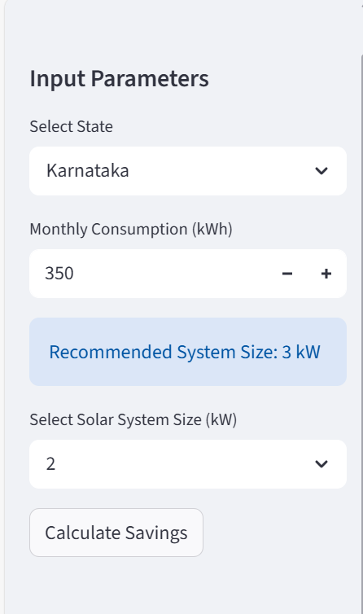
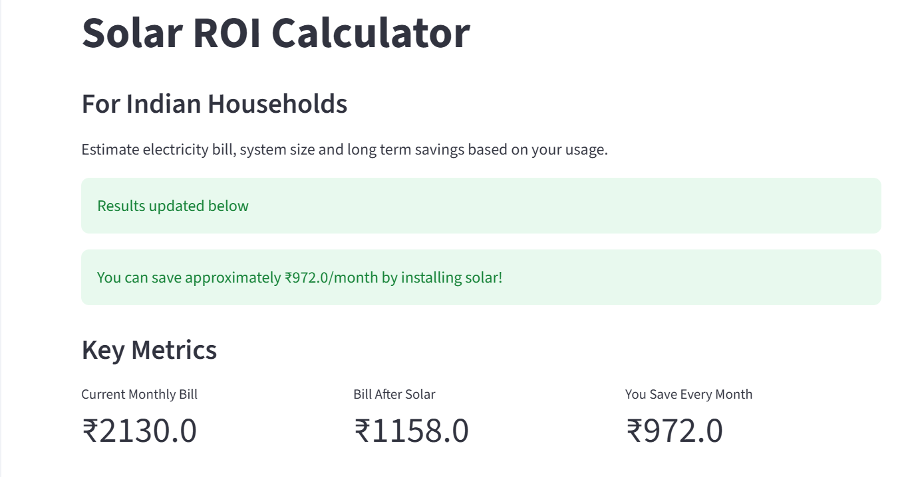
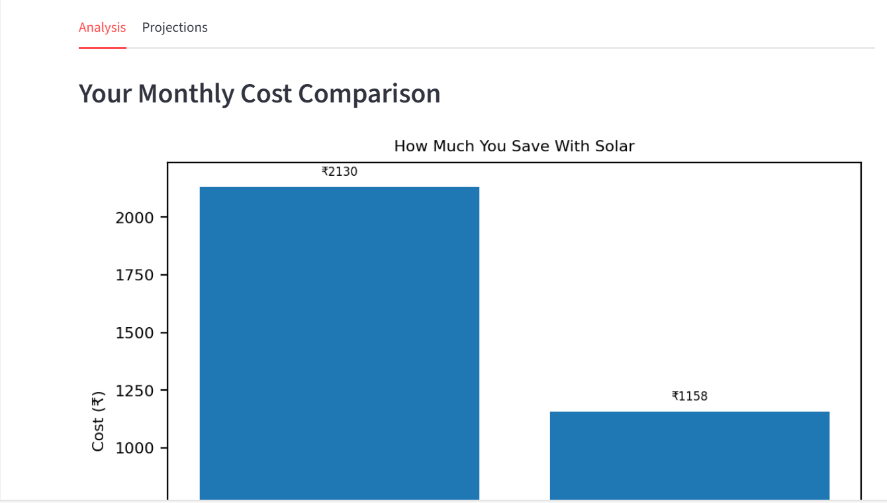
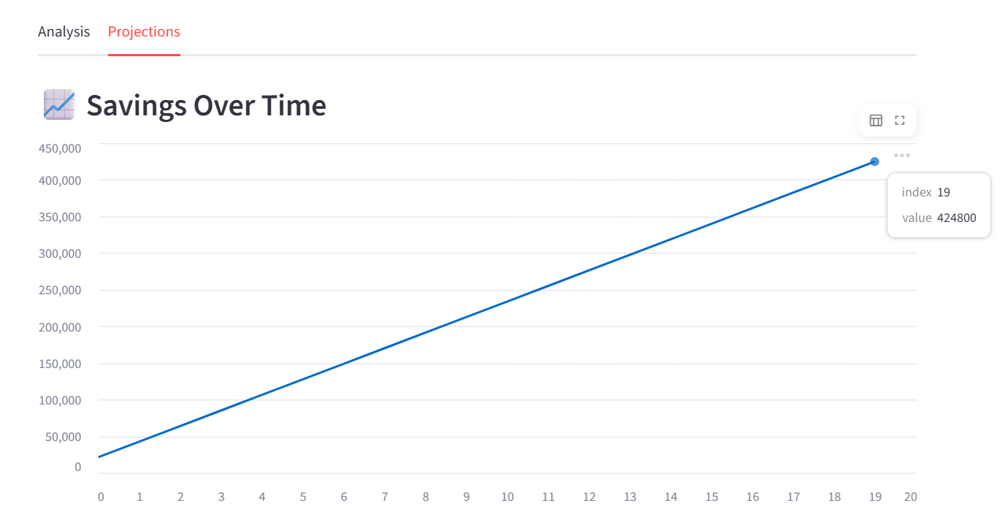
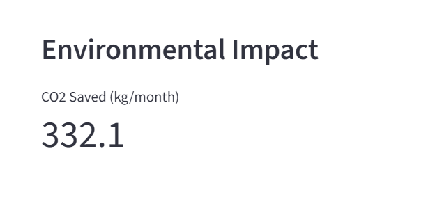

#  Solar ROI Calculator

An interactive web application that helps users estimate their electricity costs, solar savings, and return on investment (ROI) for installing rooftop solar systems in India.

---

# Description

This project simulates real-world electricity billing using slab-based tariffs and compares it with solar-powered cost savings.
It helps users:
• Understand their current electricity expenses
• Estimate optimal solar system size
• Calculate savings and payback period
• Visualize long-term financial and environmental benefits

##  Features

- Slab-based electricity bill calculation
- Automatic solar system size estimation
- Monthly & yearly savings calculation
- Payback period (ROI) estimation
- 20-year savings projection chart
- CO₂ emission reduction estimation
- Clean and user-friendly UI
---

##  Tech Stack

- Python (Pandas, Matplotlib)
- Streamlit (UI)
- Data Visualization

---

##  How It Works

1. User enters monthly electricity consumption
2. App calculates bill using slab-based tariff logic
3. Solar system size is estimated based on usage
4. Solar generation reduces grid dependency
5. Savings and ROI are calculated
6. Results are displayed using metrics and charts  

---

##  Screenshots

Interactive dashboard built using Streamlit showcasing solar ROI analysis and insights:

###  Input Panel

###  Results & Key Metrics

###  Cost Comparison

###  Savings Over Time

###  Environmental Impact


---

##  Live URL
https://solar-roi-tool.streamlit.app/

---

##  Run Locally

```bash

git clone <your-repo-link>
cd solar-roi-tool
pip install -r requirements.txt
streamlit run app.py
 

